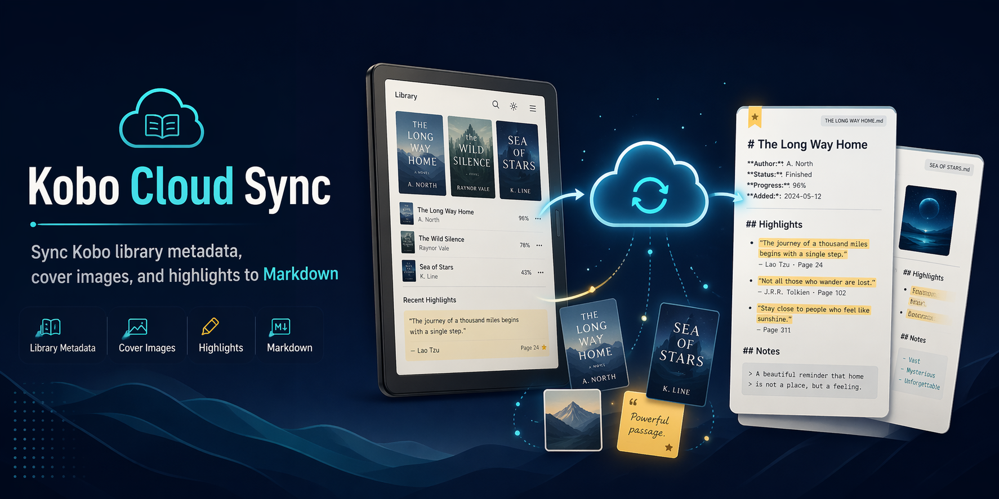

# Kobo Cloud Sync



Sync Kobo cloud library metadata, cover images, and reader highlights to Markdown.

## What It Does

- Imports a signed-in Kobo browser session from exported cookies.
- Scrapes your Kobo library for book metadata and cover images.
- Uses Kobo Web Reader's annotations API to sync highlights where available.
- Writes one Markdown file per book.

## Setup

```bash
python -m venv .venv
source .venv/bin/activate
pip install -e ".[dev]"
playwright install chromium
cp .env.example .env
```

Edit `.env` for your locale and output paths:

```bash
KOBO_COUNTRY=hk
KOBO_LANGUAGE=en
KOBO_DATA_DIR=data
MARKDOWN_DIR=data/markdown
```

## Authentication

Google sign-in blocks Playwright's bundled Chromium, so the most reliable path is:

1. Sign in to Kobo in your normal browser.
2. Export Kobo cookies to `data/kobo.cookies.json`.
3. Import them locally:

```bash
kobo-cloud import-cookies data/kobo.cookies.json
```

Cookie files and browser profiles are ignored by git.

## Usage

```bash
kobo-cloud dry-run
kobo-cloud sync
kobo-cloud sync --no-highlights
kobo-cloud sync --output-dir /path/to/notes
kobo-cloud parse /path/to/export.html
kobo-cloud serve
```

Generated Markdown defaults to `data/markdown`, with covers in `data/markdown/covers`.

## Local Web UI

If you want a lighter interface than the CLI, start the built-in local web UI:

```bash
kobo-cloud serve
```

Then open `http://127.0.0.1:8765` in your browser. The dashboard lets you:

- Check whether your saved Kobo session is still valid.
- Open the interactive login flow.
- Import exported Kobo cookies from a local JSON file.
- Preview your library with a dry run.
- Run sync with custom output and state paths.

This UI is intentionally small and local-only. The CLI remains the core interface.

## Development

```bash
pytest
python -m build
```

The package exposes a console script:

```bash
kobo-cloud --help
```

Agent workflow guidance lives in `skills/kobo-cloud-sync/SKILL.md`.
